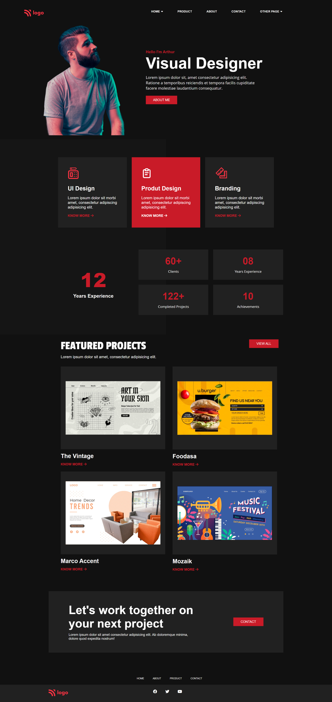

# Visual designer portfolio 

This is a portfolio website of visual designer which contains detailed information about his work.

## Preview

## Author

- [Rakshit Koyani](https://www.github.com/rakshitkoyani)

  

  

  

## What I have learnt in this project

I learn how to make responsive website using flex-wrap. and also aligning different components.

## Honest Time to finish the project

This project took me 7 hours to complete.

## Live link of the project

https://rakshit-htmlcss-project15.netlify.app/
